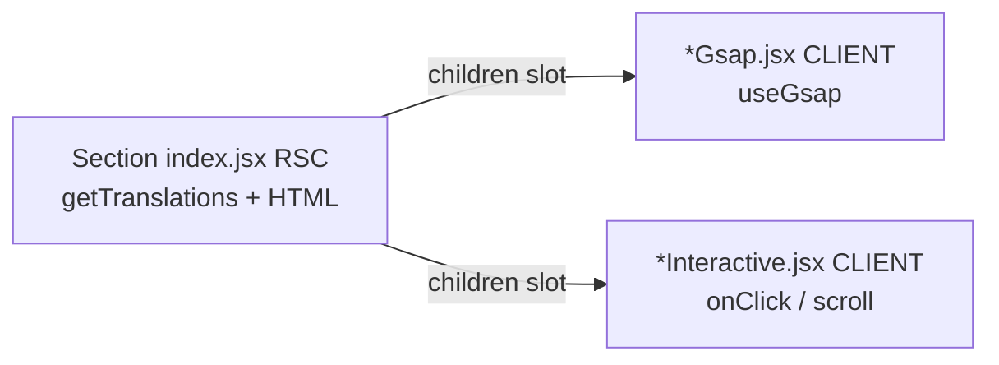

# Homepage Öncelik 1 — RSC + client island (şimdilik bu kadar)

## Karar

Evet — **şimdilik yalnızca Öncelik 1 yeterli.** Bu, Next.js’in önerdiği “Server Component default, client sadece ihtiyaçta” modeli. Önceki turdaki metadata/JSON-LD, Motion kaldırma, `dynamic()`, Header split **bu turda yok**.

## Zorunlu kısıt (önceki geri bildirim)

- Animasyon **görünümü/davranışı bozulmayacak** (GSAP scrub/stagger, MagneticHover, StackedSections, LogoLoop, Faq accordion + mevcut Motion `useReducedMotion`).
- Island extract = aynı `data-*` selector’lar, aynı tween’ler, aynı kütüphaneler; sadece **sınır taşınır**.
- “Motion’ı Faq’dan sil” **yok**. “GSAP’i kaldır” **yok**.

## Mimari kural (Öncelik 1)

| Kural                                                       | Uygulama                                                  |
| ----------------------------------------------------------- | --------------------------------------------------------- |
| Statik içerik (başlık, paragraf, kart metni, liste)         | **Server Component** + `getTranslations`                  |
| GSAP kullanan parça                                         | Ayrı `"use client"` dosya (`useGsap` burada)              |
| Event / state (click, scroll listener, accordion, magnetic) | Ayrı `"use client"`                                       |
| Form                                                        | `"use client"` (homepage’de form yok; kural ilerisi için) |



**Tipik GSAP pattern (davranış aynı):**

```jsx
// stats/index.jsx — Server
const t = await getTranslations("Stats");
return (
  <StatsReveal>
    {" "}
    {/* client: useGsap, ref on wrapper */}
    <section>...</section> {/* veya içerik children */}
  </StatsReveal>
);
```

Client wrapper yalnızca `useGsap` + `ref`; metin server’dan children veya props olarak gelir. **Tween kodu kopyalanır, değiştirilmez.**

## Section planı (homepage)

| Section                                                                   | Bugün                         | Hedef                                                                                        |
| ------------------------------------------------------------------------- | ----------------------------- | -------------------------------------------------------------------------------------------- |
| [stats](frontend/src/components/home/stats/index.jsx)                     | Full client (GSAP + i18n)     | RSC + `StatsReveal` (GSAP)                                                                   |
| [manifesto](frontend/src/components/home/manifesto/index.jsx)             | Full client                   | RSC + `ManifestoReveal` (GSAP word scrub; word split client’da kalabilir — scrub buna bağlı) |
| [benefits](frontend/src/components/home/benefits/index.jsx)               | Full client                   | RSC + `BenefitsReveal` (GSAP)                                                                |
| [solutions](frontend/src/components/home/solutions/index.jsx)             | Full client                   | RSC + `SolutionsReveal` (GSAP)                                                               |
| [hero/heroType.jsx](frontend/src/components/home/hero/heroType.jsx)       | Full client                   | RSC + `HeroReveal` (GSAP) + mevcut `LogoLoop` client                                         |
| [ecosystem](frontend/src/components/home/ecosystem/index.jsx)             | Full client (StackedSections) | RSC + mevcut `StackedSections` client (scroll listener)                                      |
| [productShowcase](frontend/src/components/home/productShowcase/index.jsx) | Aynı                          | Aynı pattern                                                                                 |
| [news](frontend/src/components/home/news/index.jsx)                       | Client fetch                  | **async RSC fetch** + mevcut `NewsCard` (MagneticHover) client                               |
| [faq](frontend/src/components/home/faq/index.jsx)                         | Full client                   | RSC metin + `FaqAccordion` client (**Motion satırı kalır**)                                  |
| Header / Footer                                                           | Layout                        | **Bu turda dokunma**                                                                         |

Manifesto notu: kelime renk scrub’ı DOM word span’lerine bağlı. Ya (A) word split + GSAP tek client child’da kalır (metin prop olarak server’dan string geçer), ya (B) tüm manifesto client kalır. **Öneri: A** — server sadece string/`getTranslations` verir; render+GSAP client’da (animasyon güvenli). Tam HTML’i server’da kelime kelime basmak scrub’ı zorlaştırır.

## Bilinçli dışarıda (sonraki tur)

- Homepage `generateMetadata` / FAQ JSON-LD
- `next/dynamic` below-fold
- Header Motion split
- `NextIntlClientProvider` messages subset
- Faq’dan Motion çıkarma
- Unused dosya temizliği

## Neden bu kadarı yeterli?

- Performans için asıl mimari kazanım: **daha ince client boundary** + News’in server’da fetch edilmesi.
- SEO: metin zaten SSR’daydı; News canlı HTML + section’ların RSC olması crawl/tutarlılığı güçlendirir.
- Animasyon riski kontrollü: tween’lere dokunulmadan dosya sınırı değişir.
- Dil: section’larda `getTranslations` (server) — next-intl App Router ile uyumlu; `setRequestLocale` page’de kalır.

## Doğrulama checklist

- Hero giriş + floating logo
- Manifesto scroll scrub
- Stats / Benefits / Solutions fade
- Ecosystem + ProductShowcase stack
- News magnetic badge
- Faq aç/kapa (+ reduced motion)
- Tüm locale’lerde metinler (`tr/en/az/ru/ka`)

## Uygulama sırası

1. Ortak/tekrarlayan GSAP wrapper pattern’ini bir section’da kanıtla (ör. **Stats** — en basit).
2. Benefits → Solutions → Hero → Manifesto.
3. Ecosystem / ProductShowcase (sadece i18n’i RSC’ye çek).
4. News RSC fetch.
5. Faq shell + accordion client.
6. Animasyon checklist.
